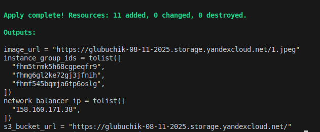
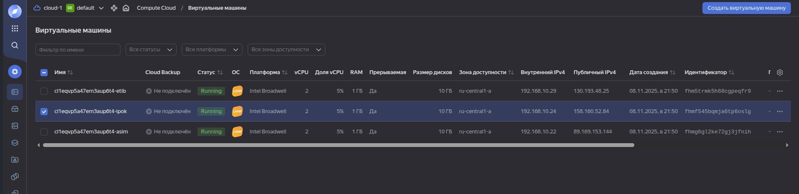
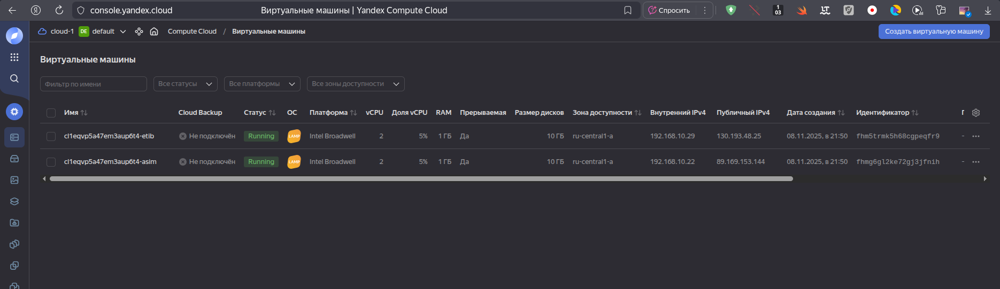
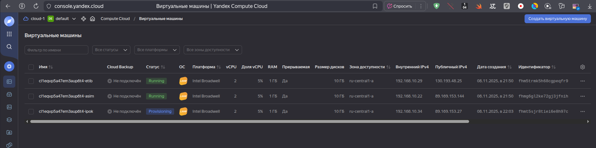

# Домашнее задание к занятию «Вычислительные мощности. Балансировщики нагрузки»  
## Задание 1. Yandex Cloud 

**Что нужно сделать**

1. Создать бакет Object Storage и разместить в нём файл с картинкой:

 - Создать бакет в Object Storage с произвольным именем (например, _имя_студента_дата_).
 - Положить в бакет файл с картинкой.
 - Сделать файл доступным из интернета.

```sh
# Создание бакета с использованием ключа
resource "yandex_storage_bucket" "glubuchik-bucket" {
  access_key = yandex_iam_service_account_static_access_key.s3-sa-keys.access_key
  secret_key = yandex_iam_service_account_static_access_key.s3-sa-keys.secret_key
  bucket     = local.bucket_name
  folder_id  = var.folder_id
  acl        = "public-read"
}

# Загружаем картинку в S3 хранилище
resource "yandex_storage_object" "glubuchik-image" {
  access_key = yandex_iam_service_account_static_access_key.s3-sa-keys.access_key
  secret_key = yandex_iam_service_account_static_access_key.s3-sa-keys.secret_key
  bucket     = yandex_storage_bucket.glubuchik-bucket.bucket
  key        = var.image.name
  source     = var.image.path
  acl        = "public-read"

  depends_on = [yandex_storage_bucket.glubuchik-bucket]
}
```
 
2. Создать группу ВМ в public подсети фиксированного размера с шаблоном LAMP и веб-страницей, содержащей ссылку на картинку из бакета:

 - Создать Instance Group с тремя ВМ и шаблоном LAMP. Для LAMP рекомендуется использовать `image_id = fd827b91d99psvq5fjit`.
 - Для создания стартовой веб-страницы рекомендуется использовать раздел `user_data` в [meta_data](https://cloud.yandex.ru/docs/compute/concepts/vm-metadata).
 - Разместить в стартовой веб-странице шаблонной ВМ ссылку на картинку из бакета.
 - Настроить проверку состояния ВМ.

```sh
# Создаем группу ВМ
resource "yandex_compute_instance_group" "group-vms" {
  name                = var.instance_resources.lamp-group.name
  folder_id           = var.folder_id
  service_account_id  = "${yandex_iam_service_account.groupvm-sa.id}"
  deletion_protection = "false"
  depends_on          = [yandex_resourcemanager_folder_iam_member.group-editor]

  instance_template {
    platform_id = var.instance_resources.lamp-group.platform_id
    resources {
      memory = var.instance_resources.lamp-group.memory
      cores  = var.instance_resources.lamp-group.cores
      core_fraction = var.instance_resources.lamp-group.core_fraction
    }

  boot_disk {
    initialize_params {
      image_id = var.instance_resources.lamp-group.disk_image
      type     = var.instance_resources.lamp-group.disk_type
      size     = var.instance_resources.lamp-group.disk_size
    }
  }

  network_interface {
    network_id         = "${yandex_vpc_network.develop.id}"
    subnet_ids         = ["${yandex_vpc_subnet.public.id}"]
    nat = var.instance_resources.lamp-group.nat
  }

  scheduling_policy {
    preemptible = true
  }

    metadata = local.instance_metadata
  }

  scale_policy {
    fixed_scale {
      size = 3
    }
  }

  allocation_policy {
    zones = [var.default_zone]
  }

  deploy_policy {
    max_unavailable = 1
    max_expansion   = 0
  }

  health_check {
    interval = 30
    timeout  = 10
    tcp_options {
      port = 80
    }
  }

  load_balancer {
      target_group_name = "lamp-group"
  }
}
```
 
3. Подключить группу к сетевому балансировщику:

 - Создать сетевой балансировщик.
```sh
# Создание сетевого балансировщика
resource "yandex_lb_network_load_balancer" "lamp-balancer" {
  name = "lamp-network-balancer"

  listener {
    name = "http-listener"
    port = 80
    external_address_spec {
      ip_version = "ipv4"
    }
  }

  attached_target_group {
    target_group_id = yandex_compute_instance_group.group-vms.load_balancer[0].target_group_id

    healthcheck {
      name = "http-healthcheck"
      http_options {
        port = 80
        path = "/"
      }
    }
  }
}
```
 - Проверить работоспособность, удалив одну или несколько ВМ.
 
 Выполняю `terraform apply` в [src](./src/)

 

 Идy на сайт по network_balancer_ip

 

Отключаю одну машину.





Сайт по прежнему доступен, так как одна из виртуальных машин продолжила работать и балансировщик нагрузки переключился на неё.

Через некоторое время, после срабатывания Healthcheck, выключенные виртуальные машины LAMP были заново запущены:




