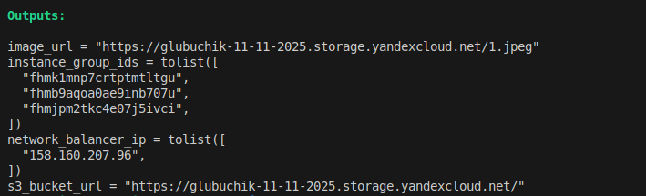
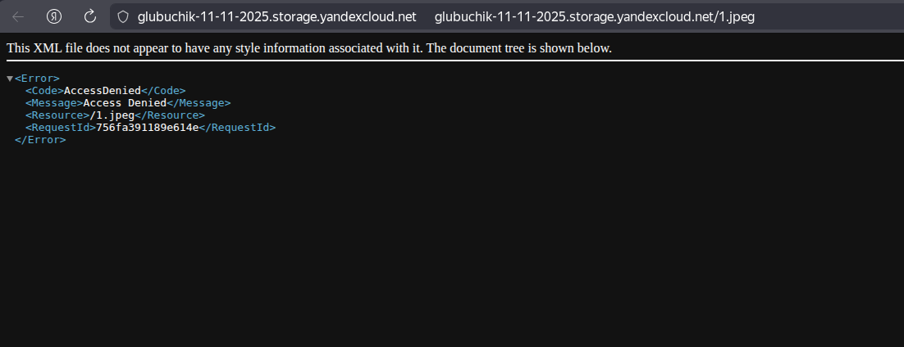
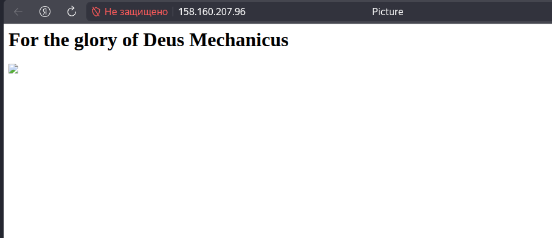

# Домашнее задание к занятию «Безопасность в облачных провайдерах»  

Используя конфигурации, выполненные в рамках предыдущих домашних заданий, нужно добавить возможность шифрования бакета.

---
## Задание 1. Yandex Cloud   

1. С помощью ключа в KMS необходимо зашифровать содержимое бакета:

 - создать ключ в KMS;
Использую код от предыдущего задания.
Добавляю в main.tf роль kms для сервисного акаунта s3
```
resource "yandex_resourcemanager_folder_iam_member" "sa-editor-encrypter-decrypter" {
  folder_id = var.folder_id
  role      = "kms.keys.encrypterDecrypter"
  member    = "serviceAccount:${yandex_iam_service_account.s3-sa.id}"
  depends_on = [yandex_iam_service_account.s3-sa]
}
```
Добавляю создание ключа
```
# Создание ключа KMS
resource "yandex_kms_symmetric_key" "bucket-key" {
  name              = "glubuchik-bucket-key"
  description       = "ключ для шифрования бакета"
  default_algorithm = "AES_256"
  rotation_period   = "24h"
}
```

 - с помощью ключа зашифровать содержимое бакета, созданного ранее.
Применяю шифрование к бакету
```
# Создание бакета с использованием ключа
resource "yandex_storage_bucket" "glubuchik-bucket" {
  access_key = yandex_iam_service_account_static_access_key.s3-sa-keys.access_key
  secret_key = yandex_iam_service_account_static_access_key.s3-sa-keys.secret_key
  bucket     = local.bucket_name
  folder_id  = var.folder_id
  acl        = "public-read-write"

  # Включение шифрования на стороне сервера с KMS
  server_side_encryption_configuration {
    rule {
      apply_server_side_encryption_by_default {
        kms_master_key_id = yandex_kms_symmetric_key.bucket-key.id
        sse_algorithm     = "aws:kms"
      }
    }
  }
}
```
После созадния всех ресурсов, картинка зашифрована





